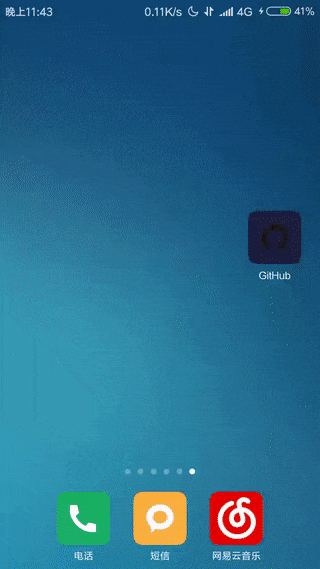

# GitHubClient
## 简介

一个根据 [GitHub API](https://developer.github.com/v3/) 做的 Android 版的客户端

目前测试阶段(测试手机：红米 NOTE)，部分功能不稳定，还需修复

## 截图

## 

## TODO

- [ ] 重构代码

- [ ] 新建 Issue

- [ ] Issue label 的支持

- [ ] 更新个人资料

- [ ] 添加其他登陆方式

- [ ] Events 以及 Pull request 的支持

- [ ] 搜索排序的支持

      ​

      ​

      ​